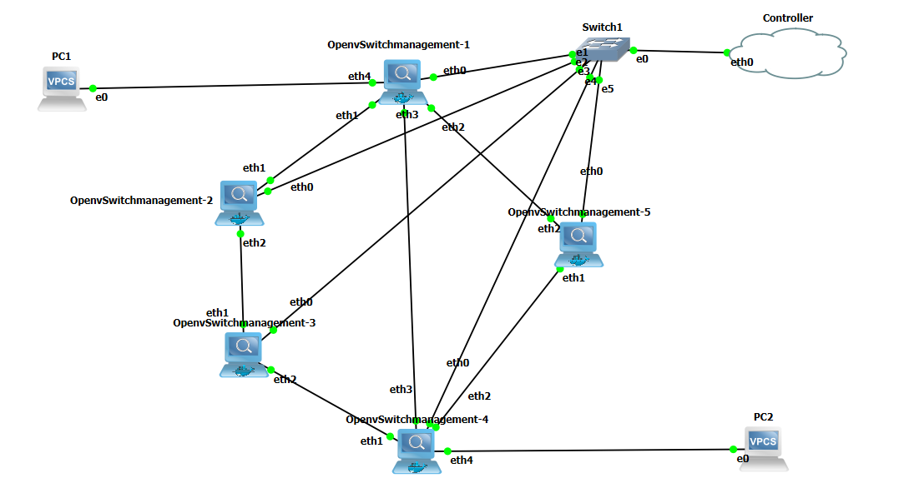
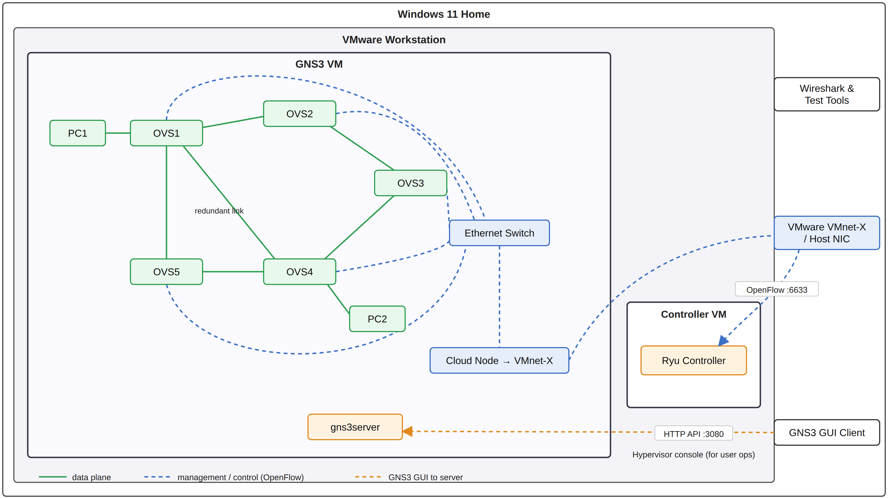
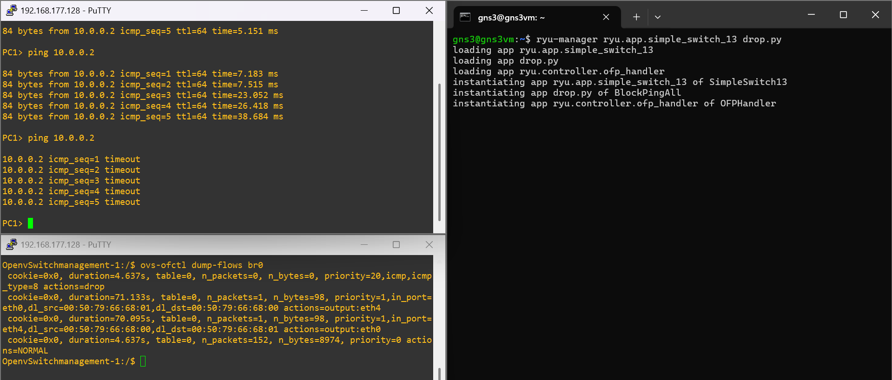
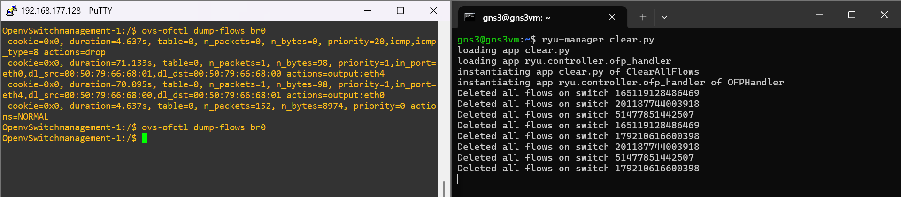
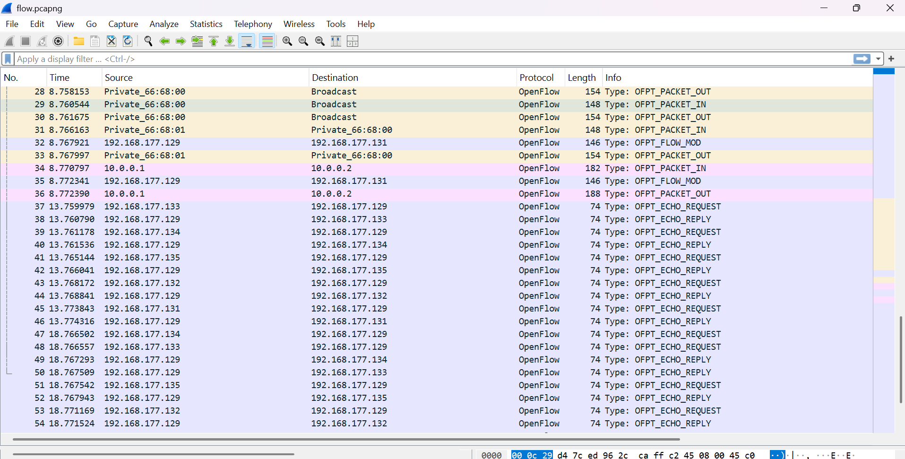
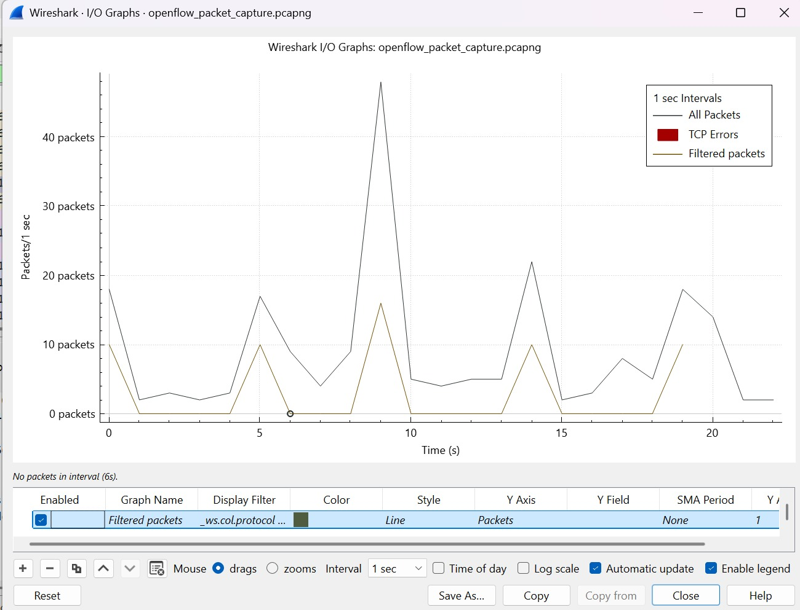
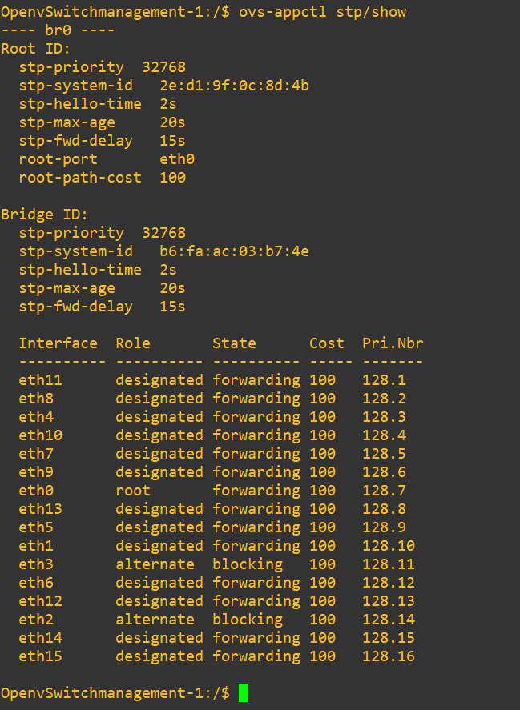

# SDN-GNS3-Ryu-Implementation: custom OpenFlow controller apps on a GNS3 / Open vSwitch testbed

Two small [Ryu](https://github.com/faucetsdn/ryu) applications that push forwarding policy from a central controller into a ring of Open vSwitch (OVS) nodes over OpenFlow 1.3. They were built and tested on a 5-switch SDN lab that I designed and ran in GNS3 on an 8 GB laptop.

| App | What it does |
|---|---|
| [`drop.py`](drop.py) | On switch connect, installs a priority-20 flow that drops ICMP echo requests, plus a priority-0 `NORMAL` rule so all other traffic still forwards. |
| [`clear.py`](clear.py) | On switch connect, sends an `OFPFC_DELETE` flow-mod (all tables, wildcard match) to wipe the switch's flow table. Used to reset state between tests. |

> **Write-up:** the full story of what broke while building this lab and how I fixed it is on Medium:[link here](https://medium.com/@mr.sanish.poudel/building-an-sdn-lab-on-an-8-gb-laptop-what-the-tutorials-skip-d749cc8c35b9)

> **Note:** the lab has since been torn down to free up resources on my machine, so everything below is backed by the screenshots and captures I took during testing (in [`images`](images)).

---

## The lab



How the pieces connect: the OVS nodes and hosts live inside the GNS3 VM, and the management links (dashed) run through a GNS3 Ethernet switch and a Cloud node onto a VMware network, which is how they reach the Ryu controller in its own VM.



- 5 OVS nodes in a ring (OVS1 to OVS5) with one redundant link between OVS1 and OVS4, to test loop prevention with STP.
- 2 virtual PCs: PC1 on OVS1, PC2 on OVS4.
- Management network: every OVS `eth0` goes to a GNS3 Ethernet switch, which connects through a GNS3 Cloud node to the host network, where the Ryu controller runs in its own Ubuntu VM.
- Control plane: OpenFlow 1.3 between each OVS and Ryu.

The original plan was 10 switches and 4 hosts in a mesh. On 8 GB RAM it caused severe lag and BSODs, so I cut it to the topology above. That roughly halved memory and CPU load and left room for packet captures.

### Software versions (these matter)

| Component | Version |
|---|---|
| Hypervisor | VMware Workstation 17.6.4 |
| Network emulator | GNS3 2.2.54 |
| Controller VM OS | Ubuntu 20.04.6 |
| Open vSwitch | 2.17.12 |
| Ryu | 4.34, installed from source |
| Python | 3.8 |
| Eventlet | 0.30.2  |
| Tools | Wireshark 4.4.8, PuTTY 0.81 |

---

## Switch configuration

Each OVS node was configured from its shell (reached over PuTTY via the management network). The pieces that mattered:

```bash
# management interface (and the other interfaces) into the bridge
ovs-vsctl add-port br0 eth0
ovs-vsctl add-port br0 eth1     # ...and the remaining data-plane interfaces

# point the switch at the Ryu controller VM
ovs-vsctl set-controller br0 tcp:192.168.177.129:6633

# loop prevention on the ring + redundant link
ovs-vsctl set bridge br0 stp_enable=true
```

> **Ordering note:** I enabled STP after the ports were already in the bridge, and it worked fine in this lab. The Open vSwitch docs recommend the opposite order (create the bridge, enable STP, *then* add ports) so a loop can't exist even transiently. If you're building this yourself, follow the docs' order.

> **A design change worth noting:** my design spec originally required each interface to sit in its own bridge to prevent broadcast storms. In practice that caused routing problems between the bridges, so I removed those bridges and kept a single bridge per switch with STP enabled. The `stp/show` output below is the result.

## Running the apps

On the controller VM:

```bash
# Ryu: install from source, not pip (the pip release was missing dependencies for me)
git clone https://github.com/faucetsdn/ryu.git
cd ryu && pip install .
pip install eventlet==0.30.2     # Ryu breaks on newer eventlet

# Block pings (run alongside the stock learning switch so other traffic still works)
ryu-manager ryu.app.simple_switch_13 drop.py

# Reset every connected switch's flow table
ryu-manager clear.py
```

On a switch, inspect the result with:

```bash
ovs-ofctl dump-flows br0
```

---

## Results

### `drop.py`: pings stop, everything else keeps working



PC1 can ping PC2 (`10.0.0.2`) before the app is loaded. After `drop.py` is loaded, the same ping times out. `ovs-ofctl dump-flows br0` on OVS1 shows the controller-installed rule:

```
priority=20,icmp,icmp_type=8 actions=drop
priority=0 actions=NORMAL
```

The higher priority drop rule matches first, and the catch-all lets everything else through.

### `clear.py`: flow tables wiped from the controller

<!-- IMAGE: docs/images/clear-demo.png (thesis Fig 16: clear.py deleting flows) -->


The left terminal first dumps OVS1's flow table (the drop rule, learned flows and the `NORMAL` rule). After `clear.py` runs, the controller logs "Deleted all flows" for each connected switch and the same `dump-flows` command returns nothing. (Each switch is logged twice because the app clears on both the switch-features and state-change events.)

### Controller and OpenFlow behaviour


| Test | Evidence |
|---|---|
| Ryu starts cleanly and listens on the OpenFlow port |  |
| Switches connect: HELLO → features → main mode | [`ryu-verbose-log.png`](images/ryu-verbose-log.png) |
| Ryu receives PACKET_IN from the switches | [`ryu-receiving-packets.png`](images/ryu-receiving-packets.png) |

**Wireshark capture of the control plane.** PACKET_IN from the switches, FLOW_MOD and PACKET_OUT from the controller, then a steady ECHO_REQUEST/REPLY keepalive from all five switches' management addresses:



<details>
<summary>I/O graph of the capture</summary>



</details>

### Underlay: management, data plane and loop prevention


| Test | Result |
|---|---|
| Each OVS can reach the controller VM ([screenshot](images/ovs-ping-controller.png)) | Pass |
| All 6 inter-OVS links reachable: 1↔2, 2↔3, 3↔4, 4↔5, 5↔1 and the redundant 1↔4 ([screenshot](images/inter-ovs-ping.png)) | Pass, no packet loss |
| STP breaks the loop; no broadcast storm ([screenshot](images/stp-show.png)) | Pass |

`ovs-appctl stp/show` on OVS1 shows `eth0` as the root port and `eth2` and `eth3` as alternate ports in the blocking state, which is what keeps the ring and the redundant link loop-free:



---

## Design requirements and how they were checked

The design spec set requirements up front and the tests above map back to them.

| Requirement | Verified by |
|---|---|
| OVS reachable from the controller via a dedicated management interface, separate from data traffic | OVS to controller ping |
| Controller listens on TCP 6633 for OpenFlow | Listening-port screenshot |
| OpenFlow 1.3 across all switches; flow entries installed and updated by the controller | Ryu verbose log, Wireshark, `dump-flows` |
| Ring and redundant link must be loop-free | STP output |
| Must run within 8 GB RAM / 4 cores | Final 5-node topology |
| Zero budget: all software free and open source | Stack above |

## Problems I had to solve

The apps are short on purpose. Most of the work was getting a stable environment under them.

| Problem | Cause | Fix |
|---|---|---|
| GNS3 VM unstable with VirtualBox | GNS3 integrates poorly with VirtualBox on Windows | Switched to VMware Workstation |
| VMs couldn't use Intel VT-x | Windows Virtualization-Based Security was holding it | Disabled VBS via the registry (this lowers a Windows security feature, so weigh the tradeoff) |
| Lag and BSODs | 10 OVS + 4 VPCs on 8 GB RAM; BSODs also appeared when opening many terminal sessions | Reduced to 5 OVS + 2 VPCs |
| GNS3 server wouldn't connect to the GUI | Firewall rule | Added an inbound rule |
| GNS3 VM and controller VM couldn't ping | No route between GNS3's internal network and the VMware host network | Added a Cloud node as a bridge to the host network |
| OVS had no way to reach the controller | Standard OVS image has no management interface, and `eth0` didn't exist on first boot | Used OVS *management* images and created `eth0` by hand |
| Broadcast storms | All ports sit in one bridge by default, so the ring and redundant link form a layer-2 loop | First tried a separate bridge and port per interface to isolate them, but that caused routing problems between the bridges. Reverted to a single bridge per switch and enabled STP instead |
| Ryu would not install or run | Ryu 4.34 doesn't work on Python 3.11; eventlet conflicted with the OVS images; the pip build lacked dependencies | Dedicated Ubuntu 20.04 VM, Python 3.8, Eventlet 0.30.2, Ryu from source |
| Controller VM cost resources | A dedicated VM needs its own RAM, CPU cores and network adapters, and the VM network adapters needed configuring (VMware bridged networking) | Accepted the cost and absorbed it by shrinking the topology |

---

## Limitations

- OVS's own documentation warns that its STP implementation is not well tested. It worked in this lab, but for anything beyond a testbed I'd look at an alternative loop-prevention approach (for example, controller-managed paths).
- `drop.py` only matches ICMP echo *requests* (type 8) and applies to every connected switch. It has no per-host or per-port policy.
- Both apps are static: they install rules on switch connect and do not react to traffic.
- No automated tests or benchmarks; verification was manual (pings, `dump-flows`, Wireshark).

## Acknowledgements

Built as my capstone project. Thanks to the people on Discord and Reddit who helped me debug this lab along the way.

## Repo layout

```
.
├── drop.py        # block ICMP echo requests
├── clear.py       # delete all flows on connect
└── images/        # screenshots, diagrams and captures from the lab
```
